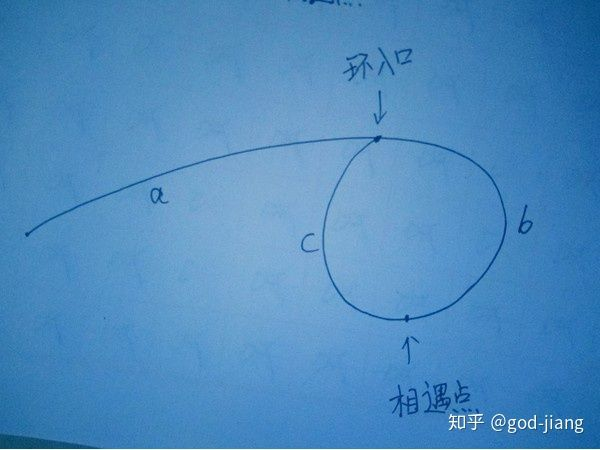

[原题链接](https://leetcode.com/problems/linked-list-cycle-ii/)

基本思路:

1. 假设有环，利用快慢指针找到相遇点
2. 让两个指针分别从链表头和相遇点重新出发，每次走一步，最后一定相遇于环入口

数学证明：
</br>

</br>
</br>
则相遇时，

快指针路程=a+（b+c）k+b，k>=1，其中 b+c 为环的长度，k 为环的圈数（k>=1，即最少一圈，不能是 0 圈，不然快慢指针走的路程一样，矛盾）。

慢指针路程=a+b。

因为快指针的路程是慢指针的路程的两倍，所以：（a+b）\*2=a+（b+c）k+b。

化简得：

a=（k-1）（b+c）+c，这个式子的意思是：链表头到环入口的距离=相遇点到环入口的距离+（k-1）圈数环长度。其中 k>=1，所以 k-1>=0 圈。所以两个指针分别从链表头和相遇点出发，最后一定相遇于环入口。

```java
/**
 * Definition for singly-linked list.
 * class ListNode {
 *     int val;
 *     ListNode next;
 *     ListNode(int x) {
 *         val = x;
 *         next = null;
 *     }
 * }
 */
public class Solution {
    public ListNode detectCycle(ListNode head) {
        if(head == null){
            return head;
        }

        ListNode slow = head;
        ListNode fast = head;
        while(fast!=null && fast.next!=null){
            slow = slow.next;
            fast = fast.next.next;
            if(slow == fast){
                break;
            }
        }
        if(fast == null || fast.next == null){
            return null;
        }
        ListNode s = head;
        while(s!=slow){
            s=s.next;
            slow = slow.next;
        }
        return slow;
    }
}
```
